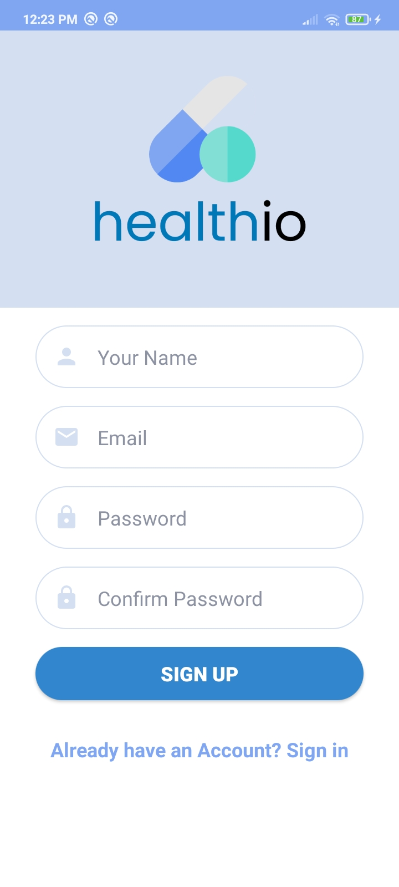
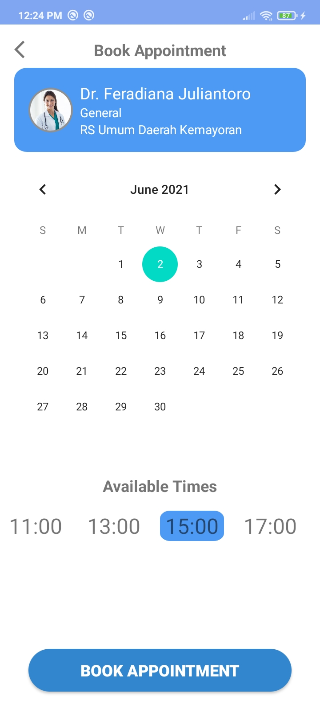

# healthio
 

Healthio is a platform dedicated to create and allow patients to book appointments, orders, and treatments with hospitals.  Here, you can book your own appointment by checking the availability of every doctor in every hospital!. This platform is made for your convenience in a new and better hospital booking system that gives you and the doctors a more reliable and easy way to meet, check up, and enjoy the medical facilities even more.

Before you enjoy the best use of the app, please verify your id/KTP with the OCR feature on the top of the home page. Book your appointment now, by selecting your type of hospital services, choose the hospitals and doctors based on various options and select your date and time!!

 
1. Offline Mode
<table>
  <tr>
    <td>  </td>
     <td>  </td>
     <td>  </td>
  </tr>
  <tr>
    <td></td>
    <td></td>
    <td></td>
  </tr>
 </table>
 
 
2. Authentication
<table>
  <tr>
    <td>  </td>
     <td>  </td>
     <td>  </td>
  </tr>
  <tr>
    <td></td>
    <td></td>
    <td></td>
  </tr>
 </table>
 
 
3. Main Activity

<table>
  <tr>
    <td>  </td>
     <td>  </td>
     <td>  </td>
  </tr>
  <tr>
    <td></td>
    <td></td>
    <td></td>
    
  </tr>
 </table>
 
 
4. Transaction
<table>
  <tr>
    <td>  </td>
     <td>  </td>
     <td>  </td>
  </tr>
  <tr>
    <td></td>
    <td></td>
    <td></td>
    <td></td>
  </tr>
 </table>
 
 
