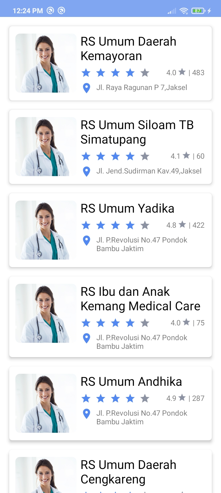

# healthio
 

Meal Rescue, merupakan aplikasi berbasis android yang 
memberikan opsi untuk save your food and save 
your budget. Kami menyediakan opsi untuk 
para masyarakat yang ingin mengurangi 
food waste dengan menjual makanan berlebih 
di marketplace kami serta orang lain dapat 
membantu Bumi dengan membeli makanan 
berlebih tersebut.
 
 
Meal Rescue memberikan opsi untuk para masyarakat yang ingin mengurangi foodwaste untuk menjual makanan berlebih dengan harga yang lebih murah di Marketplace kami. Pengguna lain dapat membantu Bumi dengan membeli makanan berlebih tersebut sehingga tidak ada makanan yang terbuang sia-sia. Meal Rescue ini menjadi win-win solution untuk para pedagang dan juga para pembeli. 
Bagaimana cara Meal Rescue bekerja?
 
•	Cari penjual makanan dan pesan melalui aplikasi.
 
•	Selamatkan makanan yang ada di toko pada waktu yang ditentukan.
 
•	Nikmati makanan sambil mengetahui bahwa Anda baru saja mengurangi food waste serta membantu Planet Bumi.
Aplikasi ini ditujukan kepada siapapun yang ingin membantu mengurangi foodwaste dengan cara membeli makanan menggunakan aplikasi kami. Kami juga menujukan aplikasi kami kepada Online Food Order Services , seperti Grab dan Gojek untuk menjadi partnership kami sebagai sistem pengantaran kami.
 
 
Meal Rescue merupakan sebuah aplikasi diciptakan atas dasar kekhawatiran tentang kondisi foodwaste yang ada di Indonesia. Menurut data dari Economist Intelligence Unit, Indonesia merupakan negara penghasil foodwaste terbesar kedua di Dunia dengan rata-rata 300 Kilogram makanan dibuang per orang setiap tahunnya.
 
 
 
Filosofi
Terdapat berbagai Activity yang dapat dilakukan pada aplikasi ini:
1. Offline Mode
<table>
  <tr>
    <td>  </td>
     <td>  </td>
     <td>  </td>
  </tr>
  <tr>
    <td></td>
    <td></td>
    <td></td>
  </tr>
 </table>
Aplikasi dimulai dengan splash screen kemudian dilanjut dengan Onboarding Screen, kemudian disusul oleh getting started screen sambil melakukan pengecekan akan koneksi.
Jika device yang digunakan saat menggunakkan aplikasi tidak memiliki koneksi internet, maka akan muncul No Connection SCreen dengan animasi burung hantu ekstensi (.gif)
 
 
 
2. Authentication
<table>
  <tr>
    <td>  </td>
     <td>  </td>
     <td>  </td>
  </tr>
  <tr>
    <td></td>
    <td></td>
    <td></td>
  </tr>
 </table>
Terdapat validation dalam form disertai dengan UX copywriting yang baik karena memberi tahu pengguna kesalahan apa yang dilakukan pengguna dan memberi tahu cara pengguna agar bisa keluar dari masalah yang sedang dihadapi. Pengguna yang sudah Sign In pun tidak perlu untuk melakukan Sign in ulang dalam aplikasi, sehingga membuat experience yang dirasakan pengguna lebih menyenangkan.
 
 
 
3. Main Activity

<table>
  <tr>
    <td>  </td>
     <td>  </td>
     <td>  </td>
  </tr>
  <tr>
    <td></td>
    <td></td>
    <td></td>
    
  </tr>
 </table>
 
 Setelah User login, user akan masuk ke Main Activity, dimana Main Activity sendiri terdiri dari home, favorite, map dan profile fragment seperti yang dapat dilihat dari screenshot diatas. Pengguna dapat mengeksplor restoran-restoran yang ada dan terdapat fitur search bar untuk mempermudah pengguna dalam mencari restoran yang diinginkan. Dalam fitur profile pun terdapat berbagai menu yang dapat diakses seperti Join Community dan terdapat juga fitur Sign out sehingga pengguna tidak perlu menghapus data untuk login menggunakkan akun lain.
  
 
 
4. Transaction

<table>
  <tr>
    <td>  </td>
     <td>  </td>
     <td>  </td>
  </tr>
  <tr>
    <td></td>
    <td></td>
    <td></td>
    <td></td>
  </tr>
 </table>
 
 Apabila user menekan salah satu restaurant yang diinginkan, ia dapat menelfon, melihat instagram dan memesan makanan lewat activity restaurant tersebut. Pembayaran akan dilakukan pada cart.
  
 
 
