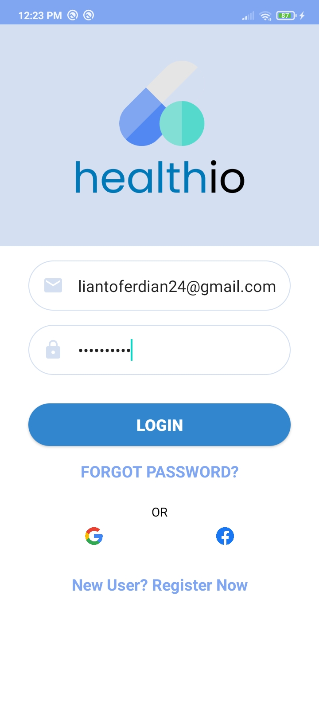

# healthio
 

Healthio is a platform dedicated to create and allow patients to book appointments, orders, and treatments with hospitals.  Here, you can book your own appointment by checking the availability of every doctor in every hospital!. This platform is made for your convenience in a new and better hospital booking system that gives you and the doctors a more reliable and easy way to meet, check up, and enjoy the medical facilities even more.

Before you enjoy the best use of the app, please verify your id/KTP with the OCR feature on the top of the home page. Book your appointment now, by selecting your type of hospital services, choose the hospitals and doctors based on various options and select your date and time!!

 

Terdapat berbagai Activity yang dapat dilakukan pada aplikasi ini:
1. Offline Mode
<table>
  <tr>
    <td>  </td>
     <td>  </td>
     <td>  </td>
  </tr>
  <tr>
    <td></td>
    <td></td>
    <td></td>
  </tr>
 </table>
Aplikasi dimulai dengan splash screen kemudian dilanjut dengan Onboarding Screen, kemudian disusul oleh getting started screen sambil melakukan pengecekan akan koneksi.
Jika device yang digunakan saat menggunakkan aplikasi tidak memiliki koneksi internet, maka akan muncul No Connection SCreen dengan animasi burung hantu ekstensi (.gif)
 
 
 
2. Authentication
<table>
  <tr>
    <td>  </td>
     <td>  </td>
     <td>  </td>
  </tr>
  <tr>
    <td></td>
    <td></td>
    <td></td>
  </tr>
 </table>
Terdapat validation dalam form disertai dengan UX copywriting yang baik karena memberi tahu pengguna kesalahan apa yang dilakukan pengguna dan memberi tahu cara pengguna agar bisa keluar dari masalah yang sedang dihadapi. Pengguna yang sudah Sign In pun tidak perlu untuk melakukan Sign in ulang dalam aplikasi, sehingga membuat experience yang dirasakan pengguna lebih menyenangkan.
 
 
 
3. Main Activity

<table>
  <tr>
    <td>  </td>
     <td>  </td>
     <td>  </td>
  </tr>
  <tr>
    <td></td>
    <td></td>
    <td></td>
    
  </tr>
 </table>
 
 Setelah User login, user akan masuk ke Main Activity, dimana Main Activity sendiri terdiri dari home, favorite, map dan profile fragment seperti yang dapat dilihat dari screenshot diatas. Pengguna dapat mengeksplor restoran-restoran yang ada dan terdapat fitur search bar untuk mempermudah pengguna dalam mencari restoran yang diinginkan. Dalam fitur profile pun terdapat berbagai menu yang dapat diakses seperti Join Community dan terdapat juga fitur Sign out sehingga pengguna tidak perlu menghapus data untuk login menggunakkan akun lain.
  
 
 
4. Transaction

<table>
  <tr>
    <td>  </td>
     <td>  </td>
     <td>  </td>
  </tr>
  <tr>
    <td></td>
    <td></td>
    <td></td>
    <td></td>
  </tr>
 </table>
 
 Apabila user menekan salah satu restaurant yang diinginkan, ia dapat menelfon, melihat instagram dan memesan makanan lewat activity restaurant tersebut. Pembayaran akan dilakukan pada cart.
  
 
 
